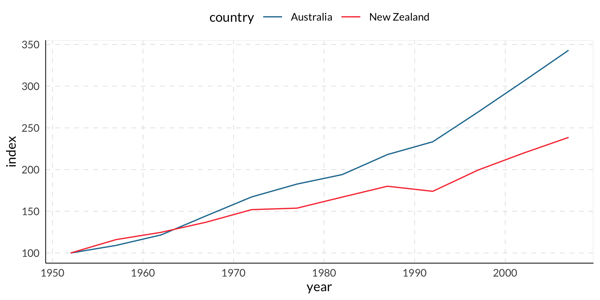

<!-- README.md is generated from README.Rmd. Please edit that file -->

# presupuestoR

<!-- badges: start -->
<!-- badges: end -->

[Español](#readme-en-español) Este paquete proporciona una colección de
funciones para el análisis presupuestario utilizando datos abiertos de
[Transparencia
Presupuestaria](https://www.transparenciapresupuestaria.gob.mx/).

[English](#readme-in-english) This package provides a collection of
functions for budget analysis using open data from [Transparency
platform in Mexico](https://www.transparenciapresupuestaria.gob.mx/).

## Readme en español

### Instalación

La versión en desarrollo puede ser instalada de
[GitHub](https://github.com/) con:

``` r
remotes::install_github("JavierMtzRdz/presupuestoR")
# Or
devtools::install_github("JavierMtzRdz/presupuestoR")   
```

### Descripción general

- `deflate_tp()`: Desinfla los montos monetarios descargando los últimos
  deflactores publicados por la plataforma de Transparencia
  Presupuestaria.
- `id_capitulo_to_desc_capitulo()`: Convierte la clave del capítulo en
  la descripción del capítulo.
- `id_concepto_to_desc_concepto()`: Convierte la clave del concepto en
  la descripción del concepto.
- `id_part_gen_to_desc_part_gen()`: Convierte la clave del ítem genérico
  en la descripción del ítem genérico.
- `id_part_esp_to_desc_part_esp()`: Convierte la clave del ítem
  específico en la descripción del ítem específico.
- `variacion_to_index()`: Genera un índice basado en cambios durante un
  período.
- `indexing()`: Indiza una serie utilizando observaciones específicas
  como puntos de referencia.
- `entidad_to_abr2()`: Abrevia el nombre de una entidad mexicana. Está
  basada en
  [LorenzoLeon/mexicoR](https://github.com/LorenzoLeon/mexicoR).
- `cve_to_ent()`: Convierte las claves del INEGI correspondientes a cada
  entidad mexicana en nombres.
- `conect_value()`: Repite el último número de una serie de categorías
  utilizando la fecha siguiente.
- `sum_pef_tp()`: Esta función agrupa datos presupuestarios según
  variables especificadas, como clasificación administrativa,
  clasificación funcional o clasificación económica.
- `bind_pef_tp()`: Aplica la función sum_pef_tp a una lista de marcos de
  datos presupuestarios, lo que te permite generar resúmenes a través de
  múltiples conjuntos de datos.
- `bind_pef_tp_wide()`: Similar a bind_pef_tp, pero organiza la salida
  en formato ancho.
- `netear_tp()`: Esta función clasifica las categorías presupuestarias
  que deben ser neteadas al realizar un análisis presupuestario neto.
- `negative_neteo_tp()`: Convierte las categorías presupuestarias con
  “Neteo” como descripción en valores negativos, típicamente utilizado
  después de netear_tp.
- `id_ramo_to_tipo_ramo()`: Convierte la clave del ramo en la
  clasificación administrativa del ramo.
- `id_ramo_to_desc_ramo()`: Convierte la clave del ramo en la
  descripción del ramo.
- `id_ramo_to_abr_ramo()`: Convierte la clave del ramo en la abreviatura
  del ramo.
- `desc_ramo_to_abr_ramo()`: Convierte la descripción del ramo en la
  abreviatura del ramo.
- `gen_tipo_programable()`: Genera una columna que indica si el gasto es
  programable o no programable.
- `gen_clas_eco()`: Genera la columna de clasificación económica en los
  datos presupuestarios. La clasificación económica fue realizada por
  [Katia Guzman](https://github.com/guzmart).
- `gen_subclas_eco()`: Genera la columna de subclasificación económica
  en los datos presupuestarios.

## Readme in English

### Installation

You can install the development version of presupuestoR from
[GitHub](https://github.com/) with:

``` r
remotes::install_github("JavierMtzRdz/presupuestoR")
# Or
devtools::install_github("JavierMtzRdz/presupuestoR")   
```

### Overview

- `deflate_tp()`: Deflates monetary amounts by downloading the latest
  deflators published by the Budget Transparency platform.
- `id_capitulo_to_desc_capitulo()`: Converts chapter ID to chapter
  description.
- `id_concepto_to_desc_concepto()`: Converts concept ID to concept
  description.
- `id_part_gen_to_desc_part_gen()`: Converts generic item ID to generic
  item description.
- `id_part_esp_to_desc_part_esp()`: Converts specific item ID to
  specific item description.
- `variacion_to_index()`: Generates an index based on changes over a
  period.
- `indexing()`: Indexes a series using specified observations as
  reference points.
- `entidad_to_abr2()`: Abbreviates the name of a Mexican entity. It is
  based on
  [LorenzoLeon/mexicoR](https://github.com/LorenzoLeon/mexicoR).
- `cve_to_ent()`: Converts INEGI codes corresponding to each Mexican
  entity into names.
- `conect_value()`: Repeat the last number of a series category using
  the following date.
- `sum_pef_tp()`: This function aggregates budget data based on
  specified variables, such as administrative classification, functional
  classification, or economic classification.
- `bind_pef_tp()`: It applies the sum_pef_tp function to a list of
  budget data frames, allowing you to generate summaries across multiple
  datasets.
- `bind_pef_tp_wide()`: Similar to bind_pef_tp, but it arranges the
  output in wide format.
- `netear_tp()`: This function classifies budget categories that need to
  be netted when performing a net budget analysis.
- `negative_neteo_tp()`: Converts budget categories with “Neteo” as the
  description to negative values, typically used after netear_tp.
- `id_ramo_to_tipo_ramo()`: Converts the ramo ID to the administrative
  classification of the ramo.
- `id_ramo_to_desc_ramo()`: Converts the ramo ID to the description of
  the ramo.
- `id_ramo_to_abr_ramo()`: Converts the ramo ID to the abbreviation of
  the ramo.
- `desc_ramo_to_abr_ramo()`: Converts the ramo description to the
  abbreviation of the ramo.
- `gen_tipo_programable()`: Generates a column indicating whether the
  expenditure is programmable or non-programmable.
- `gen_clas_eco()`: Generates the economic classification column in the
  budget data. The economic classification was made by [Katia
  Guzman](https://github.com/guzmart).
- `gen_subclas_eco()`: Generates the sub-economic classification column
  in the budget data.

## Ejemplos / examples

#### `sum_pef_tp()` and `id_ramo_to_abr_ramo()`

This simple code estimates the approved budget for each ministry in 2022
and assign its abbreviation.

``` r
budget_ministery <- budget_2022 %>% 
  sum_pef_tp(id_ramo,
             keep_mensual = F) %>% 
  mutate(abr_ramo = id_ramo_to_abr_ramo(id_ramo),
         aprobado = aprobado/1000000) %>% 
  select(abr_ramo, aprobado)

budget_ministery
#> # A tibble: 48 × 2
#>    abr_ramo        aprobado
#>    <chr>              <dbl>
#>  1 P. Legislativo    15013.
#>  2 SE                 3587.
#>  3 SEP              364600.
#>  4 SSA              193948.
#>  5 Semar             37750.
#>  6 STPS              25384.
#>  7 Sedatu            12868.
#>  8 Semarnat          40796.
#>  9 Sener             47058.
#> 10 Aport. a la SS. 1092012.
#> # ℹ 38 more rows
```

#### `deflactar_tp()`

This code estimates the value of the approved budget in 2022 with 2010
prices in a few lines of code.

``` r
budget_ministery %>% 
  mutate(aprobado_2010_prices = 
           deflactar_tp(aprobado, 
                        2022,
                        2010))
#> # A tibble: 48 × 3
#>    abr_ramo        aprobado aprobado_2010_prices
#>    <chr>              <dbl>                <dbl>
#>  1 P. Legislativo    15013.                8560.
#>  2 SE                 3587.                2045.
#>  3 SEP              364600.              207902.
#>  4 SSA              193948.              110593.
#>  5 Semar             37750.               21526.
#>  6 STPS              25384.               14475.
#>  7 Sedatu            12868.                7338.
#>  8 Semarnat          40796.               23263.
#>  9 Sener             47058.               26833.
#> 10 Aport. a la SS. 1092012.              622685.
#> # ℹ 38 more rows
```

#### `netear_tp()` and `negative_neteo_tp()`

Here, the total net State spending for 2022 is estimated in three lines
of code.

``` r
budget_2022 %>% 
  netear_tp() %>% 
  negative_neteo_tp() %>% 
  sum_pef_tp() %>% 
  transmute(comma(aprobado))
#> # A tibble: 1 × 1
#>   `comma(aprobado)`
#>   <chr>            
#> 1 7,088,250,300,000
```

#### `indexing()`

In this example, the GDP per capita for Oceania countries is indexed to
the year 1952.

``` r
# Load the gapminder library
library(gapminder)

# Select Oceania countries from the gapminder dataset
oc_gapminder <- gapminder %>% 
  filter(continent == "Oceania") 

# Display the first few rows of the Oceania dataset
oc_gapminder %>% 
  arrange(year) %>% 
  head()
#> # A tibble: 6 × 6
#>   country     continent  year lifeExp      pop gdpPercap
#>   <fct>       <fct>     <int>   <dbl>    <int>     <dbl>
#> 1 Australia   Oceania    1952    69.1  8691212    10040.
#> 2 New Zealand Oceania    1952    69.4  1994794    10557.
#> 3 Australia   Oceania    1957    70.3  9712569    10950.
#> 4 New Zealand Oceania    1957    70.3  2229407    12247.
#> 5 Australia   Oceania    1962    70.9 10794968    12217.
#> 6 New Zealand Oceania    1962    71.2  2488550    13176.

# Create a country-wise index based on GDP per capita for the year 1952
idx_gap <- oc_gapminder %>% 
  group_by(country) %>% 
  indexing(gdpPercap,
           year == 1952) 

# Display the first few rows of the indexed dataset
idx_gap %>% 
  arrange(year) %>% 
  head()
#> # A tibble: 6 × 7
#> # Groups:   country [2]
#>   country     continent  year lifeExp      pop gdpPercap index
#>   <fct>       <fct>     <int>   <dbl>    <int>     <dbl> <dbl>
#> 1 Australia   Oceania    1952    69.1  8691212    10040.  100 
#> 2 New Zealand Oceania    1952    69.4  1994794    10557.  100 
#> 3 Australia   Oceania    1957    70.3  9712569    10950.  109.
#> 4 New Zealand Oceania    1957    70.3  2229407    12247.  116.
#> 5 Australia   Oceania    1962    70.9 10794968    12217.  122.
#> 6 New Zealand Oceania    1962    71.2  2488550    13176.  125.

# Compare indexes across countries using a line plot
idx_gap %>% 
  ggplot(aes(x = year, 
             y = index,
             color = country)) +
  geom_line() 
```


